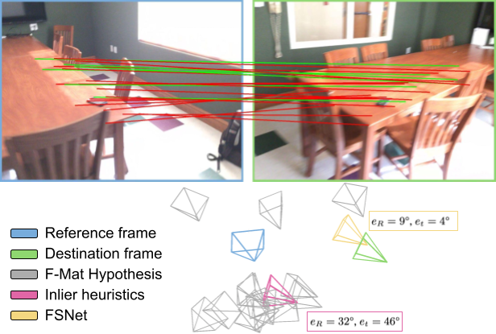
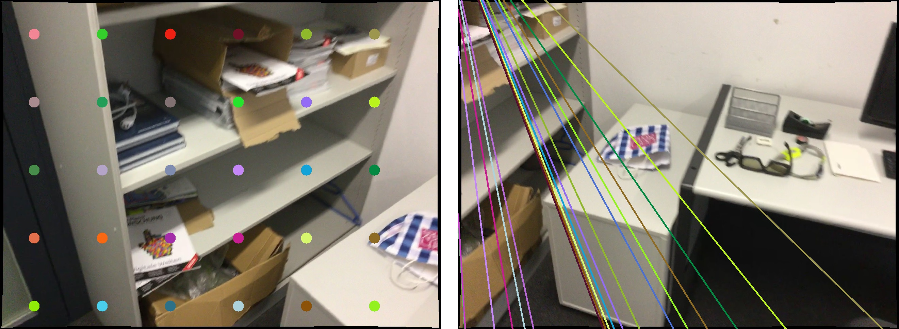

# Two-view Geometry Scoring Without Correspondences

This is the reference PyTorch implementation for testing the FSNet fundamental scoring method described in

> **Two-view Geometry Scoring Without Correspondences**
>
> Axel Barroso-Laguna, Eric Brachmann, Victor Adrian Prisacariu, Gabriel Brostow and Daniyar Turmukhambetov
>
> [Paper, CVPR 2023 (arXiv pdf - *update the link*)](https://arxiv.org/), [Supplemental Material](https://nianticlabs.github.io/scoring-without-correspondences/resources/FSNet_supp.pdf.pdf)


<div align="center">
  
  <figcaption>Fig 1. Relative pose selection based on MAGSAC++ and FSNet scoring methods.</figcaption>
</div>

<br />

This code is for non-commercial use; please see the license file for terms. If you do find any part of this codebase helpful, please cite our paper using the BibTex below and link this repo. Thank you!

## Overview

FSNet takes as input two RGB images and a fundamental matrix, and outputs the relative translation and rotation errors. Such errors are used as the scores to rank the fundamental matrices.

## Setup

Assuming a fresh [Anaconda](https://www.anaconda.com/download/) distribution, you can install dependencies with:
```shell
conda env create -f resources/FSNet_environment.yml
```
We ran our experiments with PyTorch 1.11, CUDA 11.3, Python 3.9.16 and Debian GNU/Linux 10.

## Running FSNet network
demo_inference.py can be used to select the best fundamental matrix in a pool according to FSNet scoring. We provide as an example two images, im_src.jpg and im_dst.jpg and fundamentals.npy, which contains sampled fundamental matrices for im_src.jpg and im_dst.jpg. Images and fundamental matrices are stored within the resources im_test folder. For a quick test, please run:

Arguments:

  * _src_path_: Path to source image.
  * _dst_path_: Path to destination image.
  * _weights_path_: Path to FSNet weights (options: indoor_fundamentals, indoor_essentials, outdoor_fundamentals, or outdoor_essential). Weights are stored in FSNet/weights.
  * _fundamentals_path_: Path to the numpy file storing the fundamental matrices (N x 3 x 3).

The demo script returns the top scoring fundamental matrix and its predicted translation and rotation errors. Optionally, the script also prints the epipolar lines corresponding to the selected fundamental matrix for easy inspection. See the example below:
<div align="center">
  
  <figcaption>Fig 2. Epipolar lines for top scoring fundamental matrix.</figcaption>
</div>

## BibTeX

If you use this code in your research, please consider citing our paper:

```bibtex
@inproceedings{barroso2023fsnet,
  title={Two-view Geometry Scoring Without Correspondences},
  author={Barroso-Laguna, Axel and Brachmann, Eric and Prisacariu, Victor and Brostow, Gabriel and Turmukhambetov, Daniyar},
  booktitle={Proceedings of the IEEE/CVF Conference on Computer Vision and Pattern Recognition},
  year={2023}
}
